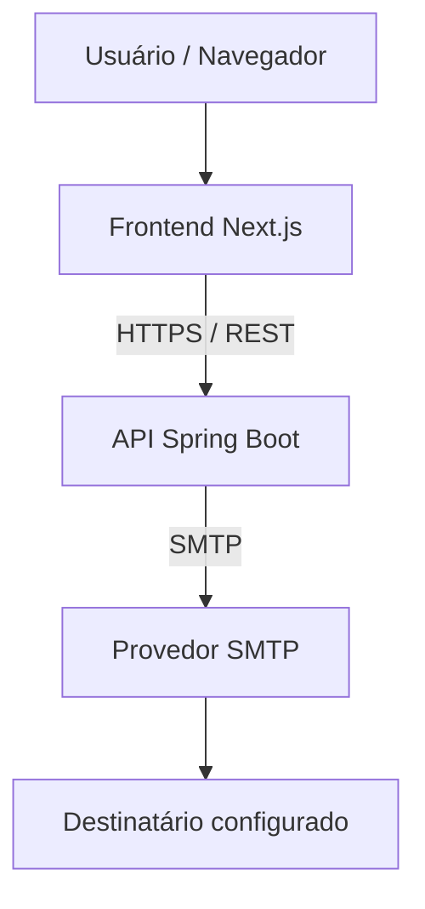

# Luis Pellis — Portfólio

Portfólio pessoal de desenvolvimento de software, construído como uma aplicação full-stack com frontend em Next.js e uma API em Java/Spring Boot. A interface usa uma linguagem visual profissional com referências sutis de HUD, sem deslocar o foco do conteúdo técnico.

## Visão geral

O projeto apresenta experiência, habilidades e projetos de Luis Pellis, com foco em desenvolvimento backend e Java. A interface concentra a navegação e o conteúdo do portfólio no frontend; a API existe para uma responsabilidade específica: receber e encaminhar mensagens de contato por SMTP.

## Arquitetura



| Camada | Responsabilidades |
| --- | --- |
| Frontend | Renderização do portfólio, navegação, responsividade, acessibilidade e comportamento do formulário de contato. |
| Backend | Validação de requisições, orquestração do contato, envio SMTP, CORS e endpoint de saúde. |
| SMTP | Aceitação e entrega da mensagem ao destinatário configurado. |

O frontend e o backend são aplicações independentes. Projetos, habilidades e experiência são dados estáticos do frontend; o fluxo de contato é a única integração obrigatória com a API.

## Stack

| Responsabilidade | Tecnologias confirmadas |
| --- | --- |
| Frontend | Next.js 15, React 19, TypeScript, Tailwind CSS |
| Backend | Java 21, Spring Boot 4.1.1, Spring Web, Bean Validation, Spring Mail, Maven |
| Qualidade e tooling | ESLint, TypeScript, Maven Wrapper, Spring Boot Test |
| Destino de deploy preparado | Vercel para `frontend`, Railway para `backend`, relay SMTP transacional externo |

## Funcionalidades

- Portfólio de página única responsivo, em pt-BR.
- Navegação por seções com rolagem suave, indicador de seção ativa e suporte mobile.
- Recursos de acessibilidade, incluindo foco visível, navegação por teclado e respeito a `prefers-reduced-motion`.
- Apresentação de habilidades, projetos e trajetória profissional.
- Canais diretos de contato e formulário com validação no navegador e tratamento de erros da API.
- Entrega de mensagens de contato via Spring Boot e SMTP.
- Endpoint de saúde para verificação da API.

## Fluxo de contato

```text
ContactForm
  -> POST /api/v1/contact
  -> validação Bean Validation
  -> ContactService
  -> SMTP
  -> destinatário configurado
```

O endereço informado pelo visitante é usado como `Reply-To`. O remetente e o destinatário são definidos pela configuração do backend, evitando usar o endereço do visitante como remetente SMTP.

## API

| Método | Rota | Descrição |
| --- | --- | --- |
| `GET` | `/api/v1/health` | Retorna o estado de saúde da API. |
| `POST` | `/api/v1/contact` | Valida e envia uma mensagem de contato por SMTP. |

Exemplo de requisição para `POST /api/v1/contact`:

```json
{
  "name": "Nome do visitante",
  "email": "visitante@example.com",
  "message": "Mensagem com pelo menos 10 caracteres."
}
```

Uma entrega aceita pelo SMTP retorna `204 No Content`. Erros de validação retornam `400`, falhas de entrega retornam `503` e falhas inesperadas retornam `500`, com uma resposta JSON estruturada.

## Estrutura do projeto

```text
nexus-portfolio/
├── frontend/
│   └── src/
│       ├── app/          # Página, layout e estilos globais
│       ├── components/   # Layout, navegação e seções
│       ├── data/         # Dados estáticos de navegação
│       └── lib/          # Cliente da API de contato
├── backend/
│   └── src/
│       └── main/
│           ├── java/     # Health, contato, CORS e API compartilhada
│           └── resources/ # Configuração Spring Boot
├── docs/                 # Especificações, arquitetura, design e deploy
├── reference/            # Material visual de referência
├── AGENTS.md
└── README.md
```

## Executando localmente

### Pré-requisitos

- Node.js e npm.
- Java 21.
- Acesso a um servidor SMTP, somente se o envio real de mensagens for necessário.

### Frontend

```bash
cd frontend
npm install
NEXT_PUBLIC_API_BASE_URL=http://localhost:8080/api/v1 npm run dev
```

O frontend fica disponível no endereço informado pelo Next.js no terminal, normalmente `http://localhost:3000`.

### Backend

Configure as variáveis de ambiente do backend conforme a seção seguinte e execute:

```bash
cd backend
./mvnw spring-boot:run
```

A API usa a porta `8080` localmente quando `PORT` não é fornecida.

## Variáveis de ambiente

O arquivo [`.env.example`](.env.example) é um modelo seguro de referência. Não inclua credenciais, senhas ou destinatários reais em arquivos versionados.

### Frontend

| Variável | Finalidade |
| --- | --- |
| `NEXT_PUBLIC_API_BASE_URL` | Base da API, incluindo `/api/v1`; é a única configuração de backend exposta ao navegador. |

### Backend

| Variável | Finalidade |
| --- | --- |
| `FRONTEND_ORIGIN` | Origem permitida pelo CORS, como o endereço local do frontend ou a origem HTTPS final. |
| `CONTACT_RECIPIENT_EMAIL` | Destinatário fixo das mensagens. |
| `CONTACT_SENDER_EMAIL` | Remetente fixo; quando ausente, o backend usa `MAIL_USERNAME`. |
| `MAIL_HOST` | Host do relay SMTP. |
| `MAIL_PORT` | Porta SMTP. |
| `MAIL_USERNAME` | Usuário SMTP. |
| `MAIL_PASSWORD` | Senha ou chave do relay SMTP. |
| `MAIL_SMTP_AUTH` | Habilita autenticação SMTP. |
| `MAIL_SMTP_STARTTLS` | Habilita STARTTLS. |
| `PORT` | Porta HTTP fornecida pela plataforma; o fallback local é `8080`. |

## Qualidade e validação

Frontend:

```bash
cd frontend
npm run lint
npm run typecheck
npm run build
```

Backend:

```bash
cd backend
./mvnw test
./mvnw verify
```

## Deploy

O repositório contém uma topologia de deploy preparada, sem assumir uma implantação ativa: Vercel para o frontend a partir de `frontend`, Railway para a API a partir de `backend` e um relay SMTP externo para a entrega de mensagens.

Consulte [docs/DEPLOYMENT.md](docs/DEPLOYMENT.md) para a configuração detalhada de ambiente, CORS, SMTP, health check, smoke tests e rollback.

## Decisões de arquitetura

- **Separação frontend/backend:** o frontend não concentra lógica de entrega de mensagens; a API mantém esse limite explícito.
- **Componentes de servidor por padrão:** limites Client Component são usados apenas onde há interação de navegador, como navegação e formulário.
- **Comportamento nativo e leve:** navegação por seções, rolagem suave e estado ativo usam APIs do navegador, sem bibliotecas de animação ou UI.
- **Configuração por ambiente:** URL da API, CORS, SMTP e portas são definidos por variáveis de ambiente.
- **CORS restrito:** a API permite uma origem configurada, somente para `GET` e `POST` sob `/api/v1/**`.
- **Sem banco de dados no escopo atual:** o backend não persiste conteúdo estático do portfólio; sua responsabilidade atual é o contato e a saúde da aplicação.
- **Remetente e Reply-To separados:** o remetente SMTP é configurado pelo servidor, enquanto o e-mail do visitante é usado apenas para resposta.

## Autor

[Luis Pellis](https://github.com/luispellis) · [LinkedIn](https://www.linkedin.com/in/luis-pellis/)
